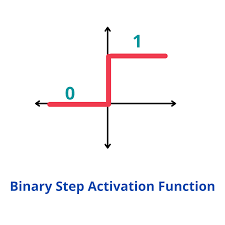

Here is a **clear, beginner-friendly explanation** of the **Binary Activation Function** that you can directly place in a **README.md or notes**.

---

# ⚡ Binary Activation Function in Neural Networks

## 📌 What is a Binary Activation Function?

A **Binary Activation Function** is the **simplest type of activation function** used in neural networks.

It converts the output of a neuron into **only two possible values**:

```
0 or 1
```

This means the neuron makes a **binary decision**:

* **0 → Inactive / False**
* **1 → Active / True**

So the neuron behaves like a **switch** that decides whether to activate or not.

---

# 🧠 Simple Real Life Example

Imagine a **motion sensor light**.

If motion is detected:

```
Light = ON (1)
```

If no motion is detected:

```
Light = OFF (0)
```

The system is making a **binary decision**, just like the **binary activation function**.

Another example:

**Exam Result**

```
Marks ≥ 40 → Pass (1)
Marks < 40 → Fail (0)
```

---

# 📊 Mathematical Representation

The binary activation function is defined as:

[
f(x) =
\begin{cases}
1 & x \geq 0 \
0 & x < 0
\end{cases}
]

### Explanation

* If the input **x is greater than or equal to 0**, the output is **1**
* If the input **x is less than 0**, the output is **0**

---

# ⚙️ How It Works in a Neural Network

First the neuron calculates:

[
z = w_1x_1 + w_2x_2 + ... + w_nx_n + b
]

Where:

* **w** = weights
* **x** = input values
* **b** = bias
* **z** = weighted sum

Then the **binary activation function** is applied:

```
if z ≥ 0 → output = 1
if z < 0 → output = 0
```

---

# 📈 Graph of Binary Activation Function



* Output suddenly jumps from **0 to 1**
* This is why it is called a **Step Function**

---

# 🎯 Why Do We Use Binary Activation Functions?

Binary activation functions are useful when the problem requires a **yes/no decision**.

They help the model:

✅ Make **clear decisions**
✅ Perform **binary classification**
✅ Reduce output complexity

---

# 📍 Where Are Binary Activation Functions Used?

They are used in **simple neural network models** such as:

### 1️⃣ Perceptron Models

Early neural networks used binary activation functions.

Example tasks:

* Spam vs Not Spam
* Fraud vs Not Fraud

---

### 2️⃣ Rule-Based Decision Systems

Example:

* Loan Approval

```
Credit Score ≥ threshold → Approve (1)
Credit Score < threshold → Reject (0)
```

---

### 3️⃣ Basic Classification Problems

Example:

| Problem              | Output               |
| -------------------- | -------------------- |
| Email Spam Detection | Spam / Not Spam      |
| Disease Detection    | Disease / No Disease |
| Login Authentication | Valid / Invalid      |

---

# 📌 In Which Scenario Do We Use Binary Activation Functions?

Binary activation functions are useful when:

### ✔ Scenario 1 — Two Possible Outcomes

When output has **only two classes**.

Example:

```
0 → Fake News
1 → Real News
```

---

### ✔ Scenario 2 — Simple Neural Network Models

Used in **single layer perceptrons** or **early machine learning models**.

---

### ✔ Scenario 3 — Rule-Based AI Systems

When decisions are **threshold based**.

Example:

```
Temperature ≥ 38°C → Fever
Temperature < 38°C → Normal
```

---

# ⚠️ Limitations of Binary Activation Function

Although simple, binary activation functions have major problems:

### ❌ Not Differentiable

The function has a **sudden jump**, so gradients cannot be calculated easily.

Because of this, **backpropagation cannot work properly**.

---

### ❌ Not Suitable for Deep Learning

Modern neural networks prefer:

* **ReLU**
* **Sigmoid**
* **Tanh**
* **Softmax**

because they allow **smooth learning and gradient optimization**.

---

# 🧾 Summary

| Feature       | Binary Activation Function |
| ------------- | -------------------------- |
| Output Values | 0 or 1                     |
| Type          | Step Function              |
| Use Case      | Binary classification      |
| Common Model  | Perceptron                 |
| Limitation    | Not differentiable         |

---

# 🚀 Final Idea

Binary activation functions act like a **decision switch in neural networks**.

They are useful for **simple classification problems**, but modern deep learning models prefer **smooth activation functions** like **ReLU or Sigmoid**.

---