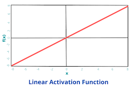

# 📈 Linear Activation Function in Neural Networks

## 📌 What is a Linear Activation Function?

A **Linear Activation Function** is the simplest activation function used in neural networks.

It simply returns the **input value without changing it**.

In other words, the output is **directly proportional to the input**.

So whatever value the neuron receives after calculation, it **passes the same value forward**.

---

# 🧠 Simple Real-Life Example

Imagine a **water pipe** 🚰.

* Water enters the pipe
* The pipe does not change the flow
* The same amount of water comes out

```
Input Water → Pipe → Output Water
```

Similarly in a **Linear Activation Function**:

```
Input → Linear Function → Same Output
```

The function does **not modify the signal**.

---

# 📊 Mathematical Representation

The Linear Activation Function is defined as:

[
f(x) = x
]

Sometimes it is written as:

[
f(x) = ax
]

Where:

* **x** = input to the neuron
* **a** = constant (slope of the line)

---

### Example

| Input (x) | Output f(x) |
| --------- | ----------- |
| -3        | -3          |
| 0         | 0           |
| 5         | 5           |
| 10        | 10          |

The output is **exactly the same as the input**.

---

# ⚙️ How It Works in a Neural Network

A neuron first calculates the **weighted sum**:

[
z = w_1x_1 + w_2x_2 + ... + w_nx_n + b
]

Where:

* **w** = weights
* **x** = inputs
* **b** = bias

Then the linear activation function is applied:

[
f(z) = z
]

So the **final output = weighted sum**.

---

# 📉 Graph of Linear Activation Function




The graph is a **straight line**, which is why it is called a **linear function**.

---

# 🎯 Why Do We Use Linear Activation Functions?

Linear activation functions are mainly used when we want the model to **predict continuous numerical values**.

They help the model output **any real number**.

---

# 📍 Where Are Linear Activation Functions Used?

They are mostly used in **Regression Problems**.

### Example Applications

| Problem                | Example Output |
| ---------------------- | -------------- |
| House Price Prediction | ₹50,00,000     |
| Temperature Prediction | 32°C           |
| Stock Price Prediction | ₹150           |
| Sales Forecasting      | 10,000 units   |

Since these values are **continuous numbers**, linear activation works well.

---

# 📌 In Which Scenario Do We Use Linear Activation Functions?

### ✔ Scenario 1 — Regression Problems

When output values are **continuous numbers**.

Example:

```
Input: House features
Output: House price
```

---

### ✔ Scenario 2 — Output Layer of Regression Models

In many neural networks, the **final layer uses linear activation** to predict numeric values.

---

### ✔ Scenario 3 — Prediction Systems

Used in systems predicting:

* prices
* temperatures
* sales
* financial data

---

# ⚠️ Limitations of Linear Activation Function

Although simple, linear activation functions have major limitations.

### ❌ Cannot Learn Complex Patterns

If we use linear activation in **all layers**, the entire neural network becomes a **linear model**.

Even with many layers, the network behaves like **simple linear regression**.

---

### ❌ No Non-Linearity

Real-world problems are **non-linear**, such as:

* image recognition
* speech recognition
* medical diagnosis

Linear activation cannot capture these complex relationships.

---

# 🧾 Summary

| Feature      | Linear Activation Function    |
| ------------ | ----------------------------- |
| Formula      | (f(x) = x)                    |
| Output Range | (-∞) to (+∞)                  |
| Graph        | Straight line                 |
| Main Use     | Regression problems           |
| Limitation   | Cannot learn complex patterns |

---

# 🚀 Final Idea

The **Linear Activation Function** simply passes the input directly to the output without modification.

It is mainly used in the **output layer of regression models**, where the network needs to predict **continuous values** like price, temperature, or sales.

However, for **deep learning tasks**, we usually use non-linear activation functions like:

* **ReLU**
* **Sigmoid**
* **Tanh**

because they allow neural networks to **learn complex patterns**.

---

