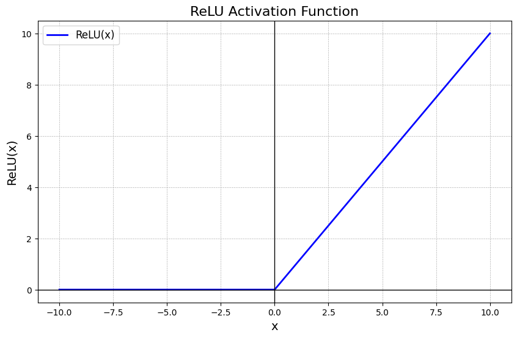

Here is a **simple and beginner-friendly explanation of the ReLU (Rectified Linear Unit) Activation Function** that you can use in your **README.md or deep learning notes**.

---

# ⚡ ReLU (Rectified Linear Unit) Activation Function

## 📌 What is the ReLU Activation Function?

The **ReLU (Rectified Linear Unit)** is one of the **most widely used activation functions in deep learning**.

It simply converts **negative values to 0** and keeps **positive values unchanged**.

So the function behaves like a **filter** that removes negative signals and allows positive signals to pass through.

---

# 🧠 Simple Real-Life Example

Imagine a **water filter system**.

* **Dirty water (negative values)** → blocked ❌
* **Clean water (positive values)** → allowed to pass ✅

Similarly, ReLU works like this:

```text
Negative input → 0
Positive input → Same value
```

Example:

| Input | Output |
| ----- | ------ |
| -5    | 0      |
| -2    | 0      |
| 0     | 0      |
| 3     | 3      |
| 7     | 7      |

---

# 📊 Mathematical Representation

The ReLU function is defined as:

[
f(x) = \max(0, x)
]

This means:

[
f(x) =
\begin{cases}
0 & x < 0 \
x & x \ge 0
\end{cases}
]

Where:

* **x** = input value

---

# ⚙️ How It Works in Neural Networks

First, the neuron calculates the **weighted sum**:

[
z = w_1x_1 + w_2x_2 + ... + w_nx_n + b
]

Where:

* **w** = weights
* **x** = inputs
* **b** = bias

Then the **ReLU activation function** is applied:

[
f(z) = \max(0, z)
]

If the value is **negative → output becomes 0**
If the value is **positive → output remains the same**

---

# 📈 Graph of ReLU Function


Key idea:

* **Negative side = 0**
* **Positive side = straight line**

---

# 🎯 Why Do We Use ReLU?

ReLU is extremely popular because it:

✅ Is **computationally simple**
✅ Helps models **train faster**
✅ Reduces the **vanishing gradient problem**
✅ Works well for **deep neural networks**

Because of these advantages, most modern deep learning models use **ReLU in hidden layers**.

---

# 📍 Where Is ReLU Used?

### 1️⃣ Hidden Layers of Deep Neural Networks

ReLU is most commonly used in the **hidden layers**.

Example:

```
Input Layer → Hidden Layer (ReLU) → Hidden Layer (ReLU) → Output Layer
```

---

### 2️⃣ Convolutional Neural Networks (CNN)

ReLU is heavily used in **computer vision models** such as:

* Image classification
* Object detection
* Face recognition

Example:

```
Image → CNN → ReLU → Feature Map
```

---

### 3️⃣ Deep Learning Applications

Used in many AI systems like:

* Self-driving cars 🚗
* Image recognition 📷
* Speech recognition 🎙️
* Recommendation systems 🎬

---

# 📌 In Which Scenario Do We Use ReLU?

### ✔ Scenario 1 — Deep Neural Networks

ReLU works very well in **deep architectures with many layers**.

---

### ✔ Scenario 2 — Computer Vision Models

Used in **CNN models** for processing images.

---

### ✔ Scenario 3 — Large Datasets

ReLU performs efficiently when training models with **large datasets**.

---

# ⚠️ Limitations of ReLU

### ❌ Dying ReLU Problem

If a neuron receives **negative inputs repeatedly**, it may always output **0**, meaning the neuron stops learning.

---

### ❌ Not Zero-Centered

Outputs are always **≥ 0**, which sometimes affects learning dynamics.

---

# 🔍 Variants of ReLU

To solve ReLU limitations, researchers developed improved versions:

| Variant         | Idea                           |
| --------------- | ------------------------------ |
| Leaky ReLU      | Allows small negative values   |
| Parametric ReLU | Learns slope for negative side |
| ELU             | Smooth negative outputs        |

---

# 🧾 Summary

| Feature      | ReLU Function       |
| ------------ | ------------------- |
| Formula      | (f(x) = \max(0, x)) |
| Output Range | 0 to ∞              |
| Graph        | Half linear         |
| Main Use     | Hidden layers       |
| Advantage    | Fast and efficient  |
| Limitation   | Dying ReLU problem  |

---

# 🚀 Final Idea

The **ReLU Activation Function** is one of the most important activation functions in modern deep learning.

It removes **negative values and keeps positive values**, helping neural networks learn **faster and more efficiently**.

Because of its simplicity and performance, ReLU is widely used in **deep neural networks, CNNs, and many modern AI models**.
