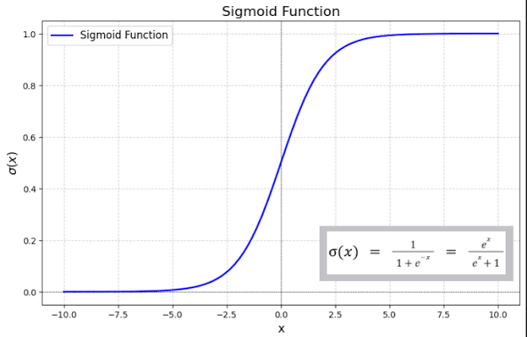

# 📊 Sigmoid Activation Function in Neural Networks

## 📌 What is a Sigmoid Activation Function?

The **Sigmoid Activation Function** is a commonly used activation function in neural networks that converts any input value into a **number between 0 and 1**.

Because of this property, it is often used when the model needs to **predict probabilities**.

For example:

```
0   → Very unlikely
0.5 → Neutral
1   → Very likely
```

So the sigmoid function helps the neural network **decide how confident it is about a prediction**.

---

# 🧠 Simple Real-Life Example

Imagine a **disease prediction system**.

The model analyzes a medical report and produces a probability:

```
0.90 → 90% chance of disease
0.20 → 20% chance of disease
```

If the probability is greater than **0.5**, we might classify it as:

```
1 → Disease Present
```

If it is less than **0.5**:

```
0 → No Disease
```

The **Sigmoid Function converts raw numbers into probabilities**.

---

# 📊 Mathematical Representation

The sigmoid function is defined as:

[
f(x) = \frac{1}{1 + e^{-x}}
]

Where:

* **x** = input to the neuron
* **e** = Euler’s number (≈ 2.718)

---

### Example Values

| Input (x) | Output f(x) |
| --------- | ----------- |
| -5        | 0.006       |
| -1        | 0.27        |
| 0         | 0.50        |
| 1         | 0.73        |
| 5         | 0.99        |

This shows that the output **always stays between 0 and 1**.

---

# 📉 Graph of Sigmoid Function


The graph forms an **S-shaped curve**, which is why it is sometimes called the **Logistic Function**.

---

# ⚙️ How It Works in Neural Networks

First, the neuron calculates the **weighted sum**:

[
z = w_1x_1 + w_2x_2 + ... + w_nx_n + b
]

Where:

* **w** = weights
* **x** = inputs
* **b** = bias

Then the sigmoid function is applied:

[
f(z) = \frac{1}{1 + e^{-z}}
]

This converts the output into a **probability value between 0 and 1**.

---

# 🎯 Why Do We Use Sigmoid Activation Function?

Sigmoid activation is useful because it:

✅ Converts values into **probabilities**
✅ Works well for **binary classification problems**
✅ Produces **smooth and continuous output**

---

# 📍 Where Is Sigmoid Activation Used?

### 1️⃣ Binary Classification Problems

Problems where the output has **two classes**.

Examples:

| Problem              | Output          |
| -------------------- | --------------- |
| Email Spam Detection | Spam / Not Spam |
| Disease Prediction   | Yes / No        |
| Fraud Detection      | Fraud / Legit   |

---

### 2️⃣ Logistic Regression Models

Sigmoid is the **core function used in logistic regression**.

---

### 3️⃣ Output Layer of Binary Neural Networks

In many neural networks, the **final layer uses sigmoid** to generate a probability.

---

# 📌 In Which Scenario Do We Use Sigmoid?

Sigmoid is used when:

### ✔ Scenario 1 — Probability Prediction

When the output should represent **probability**.

Example:

```
Output = 0.85
Meaning = 85% chance of positive class
```

---

### ✔ Scenario 2 — Binary Decision Problems

When there are **two possible outcomes**.

Example:

```
0 → Not Spam
1 → Spam
```

---

### ✔ Scenario 3 — Medical Diagnosis Systems

Example:

```
0.92 → High probability of disease
```

---

# ⚠️ Limitations of Sigmoid Function

Although widely used earlier, sigmoid has some drawbacks.

### ❌ Vanishing Gradient Problem

For very large or very small inputs, the gradient becomes **almost zero**, which slows down learning.

---

### ❌ Not Zero-Centered

Output is always **between 0 and 1**, which can slow down optimization.

---

### ❌ Slow Training in Deep Networks

Modern deep learning models often prefer **ReLU** because it trains faster.

---

# 🧾 Summary

| Feature      | Sigmoid Function              |
| ------------ | ----------------------------- |
| Formula      | (f(x) = \frac{1}{1 + e^{-x}}) |
| Output Range | 0 to 1                        |
| Graph Shape  | S-shaped curve                |
| Main Use     | Binary classification         |
| Limitation   | Vanishing gradient            |

---

# 🚀 Final Idea

The **Sigmoid Activation Function** converts any input value into a **probability between 0 and 1**, making it very useful for **binary classification problems** such as spam detection, disease prediction, and fraud detection.

Although modern deep learning often uses **ReLU**, sigmoid is still important for **output layers in binary classification models**.

---
