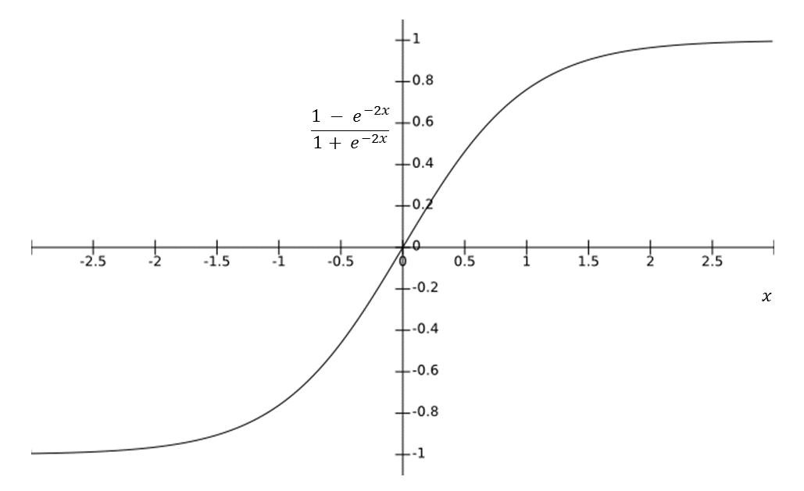

Here is a **simple and beginner-friendly explanation of the Tanh (Hyperbolic Tangent) Activation Function** that you can use in your **README.md or deep learning notes**.

---

# 📊 Tanh (Hyperbolic Tangent) Activation Function

## 📌 What is the Tanh Activation Function?

The **Tanh (Hyperbolic Tangent) Activation Function** is a popular activation function used in neural networks.

It converts any input value into an output between:

```id="4w8pht"
-1 and 1
```

Because of this range, it helps neural networks understand **both positive and negative relationships in data**.

The graph of the tanh function looks like an **S-shaped curve**, similar to the sigmoid function.

---

# 🧠 Simple Real-Life Example

Imagine a **feedback system for a product review**.

The sentiment can be:

```id="g9b2u1"
1   → Positive review 😊
0   → Neutral review 😐
-1  → Negative review 😞
```

The **Tanh function works in a similar way**, where outputs can represent **positive, neutral, or negative signals**.

---

# 📊 Mathematical Representation

The Tanh function is defined as:

[
f(x) = \tanh(x)
]

It can also be written as:

[
\tanh(x) = \frac{e^x - e^{-x}}{e^x + e^{-x}}
]

Where:

* **x** = input value
* **e** = Euler’s number (≈ 2.718)

---

# 📈 Output Range

| Input | Output |
| ----- | ------ |
| -∞    | -1     |
| 0     | 0      |
| +∞    | 1      |

Example values:

| Input (x) | Output |
| --------- | ------ |
| -2        | -0.96  |
| -1        | -0.76  |
| 0         | 0      |
| 1         | 0.76   |
| 2         | 0.96   |

---

# 📉 Graph of Tanh Function



The graph is **S-shaped and centered around zero**.

---

# ⚙️ How It Works in Neural Networks

First the neuron calculates the **weighted sum**:

[
z = w_1x_1 + w_2x_2 + ... + w_nx_n + b
]

Where:

* **w** = weights
* **x** = inputs
* **b** = bias

Then the **tanh activation function** is applied:

[
f(z) = \tanh(z)
]

The output will always be between **-1 and 1**.

---

# 🎯 Why Do We Use Tanh Activation Function?

Tanh is useful because it:

✅ Produces **both positive and negative outputs**
✅ Is **zero-centered**, which helps faster learning
✅ Works better than sigmoid in many hidden layers

---

# 📍 Where Is Tanh Used?

### 1️⃣ Hidden Layers of Neural Networks

Tanh is commonly used in **hidden layers** of neural networks.

---

### 2️⃣ Recurrent Neural Networks (RNN)

Tanh is widely used in:

* **RNN**
* **LSTM**
* **GRU**

These models are used in:

* Language translation
* Speech recognition
* Text prediction

---

### 3️⃣ Natural Language Processing (NLP)

Example applications:

* Sentiment analysis
* Chatbots
* Language models

---

# 📌 In Which Scenario Do We Use Tanh?

### ✔ Scenario 1 — When Data Has Positive and Negative Values

Example:

```id="7ifj1d"
Temperature difference
Stock market changes
Signal processing
```

---

### ✔ Scenario 2 — Hidden Layers of Neural Networks

Tanh works well for **internal layers** where the network needs to learn complex patterns.

---

### ✔ Scenario 3 — Sequential Data Models

Used in models that process **time-based or sequence data**.

Example:

* Text
* Speech
* Time series data

---

# ⚠️ Limitations of Tanh Function

### ❌ Vanishing Gradient Problem

For very large inputs, gradients become very small, which slows down learning.

---

### ❌ Slower Compared to ReLU

Modern deep learning models often prefer **ReLU** because it trains faster.

---

# 🔍 Difference Between Sigmoid and Tanh

| Feature        | Sigmoid | Tanh    |
| -------------- | ------- | ------- |
| Output Range   | 0 to 1  | -1 to 1 |
| Zero Centered  | ❌ No    | ✅ Yes   |
| Learning Speed | Slower  | Faster  |

Because tanh is **zero-centered**, it usually performs **better than sigmoid in hidden layers**.

---

# 🧾 Summary

| Feature      | Tanh Function        |
| ------------ | -------------------- |
| Formula      | ( \tanh(x) )         |
| Output Range | -1 to 1              |
| Graph        | S-shaped             |
| Main Use     | Hidden layers, RNN   |
| Advantage    | Zero-centered output |
| Limitation   | Vanishing gradient   |

---

# 🚀 Final Idea

The **Tanh Activation Function** is an improved version of the sigmoid function that outputs values between **-1 and 1**.

Because it is **zero-centered**, it helps neural networks learn faster and is commonly used in **hidden layers and recurrent neural networks**.

However, modern deep learning models often use **ReLU** because it avoids the **vanishing gradient problem**.

---